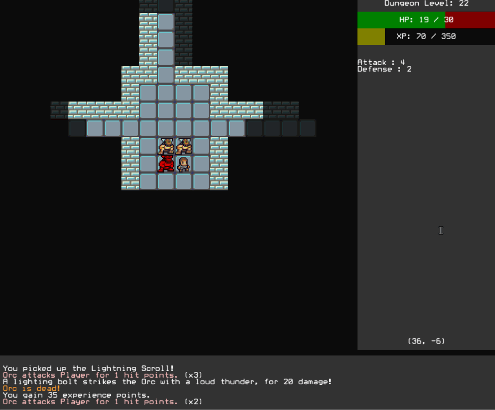

# rlkivy

rlkivy is a RogueLike Game made in Python using Kivy. The purpose is to make a Kivy version of the [roguelike tutorial](http://rogueliketutorials.com/)

## Installation

Python 3.7

```bash
cd "/directory-where-python-script-is"
git clone https://github.com/Sunnigen/rlkivy.git
cd rlkivy-master
python -m pip install -r requirements.txt
python main.py
```

## Current Progress


