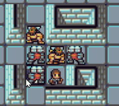

# rlkivy

rlkivy is a RogueLike Game made in Python using Kivy.

I am striving make a polished Kivy version of the [roguelike tutorial](http://rogueliketutorials.com/).

## Installation

Python 3.7

```bash
cd "/directory-where-python-script-is"
git clone https://github.com/Sunnigen/rlkivy.git
cd rlkivy-master
python -m pip install -r requirements.txt
python main.py
```

## Current Progress
**08/11/2021**

Added bit masking for walls.

See [V1.0.0 release plan](https://github.com/Sunnigen/rlkivy/projects/1) in projects tab for current progress!


`
*Idle animations In unison!*
